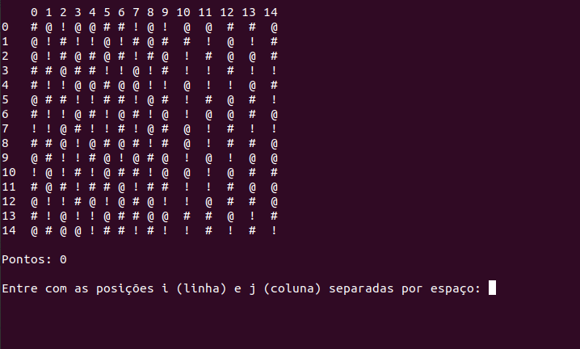

<br />
<p align="center">
  

  <h3 align="center">Jogo Bejeweled</h3>

  <p align="center">
    Disciplina: MAB601 - T.E. em Engenharia de Software - Prof. Paulo Roma
    <br />
    Alunos: Diego e Gabrielly
    <br />
    <a href="bejeweled_cmd.js">Jogo em linha de comando</a>
    ·
    <a href="index.html">Jogo com interface</a>
  </p>
</p>


<details open="open">
  <summary>Sumário</summary>
  <ol>
    <li>
      <a href="#sobre-o-jogo">Sobre o jogo</a>
    </li>
    <li>
        <a href="#versao-linha-de-comando">Versão linha de comando</a>
        <ul>
            <li><a href="#prerequisitos">Pré-requisitos</a></li>
            <li><a href="#execucao">Execução</a></li>
      </ul>
    </li>
  </ol>
</details>


## Sobre o jogo


BejeweledR© ́e um jogo criado pela PopCap Games em 2001.  V arias versões estão disponíveis online e em dispositivos como iPhone, iPad e Android.  O jogo consiste em uma grade (geralmente 8x8) de “jóias” de diferentes formas e cores.  O objetivo  ́e trocar as posições de duas jóias para que haja pelo menos três do mesmo tipo, em uma linha ou coluna.  Quando isso ocorre, essa sequência de 3 ou mais joias são exluídas,  as  jóias  acima  caem  para  preencher  os  lugares  vazios  e  novas  jóias são adicionadas ao topo.

[Saiba mais](https://en.wikipedia.org/wiki/Bejeweled)

## Versão linha de comando

Nesse projeto será realizado uma versão simplificada do jogo feita na linguagem JavaScript, onde poderemos jogar através da linha de comando informando a posição da peça e para onde a mesma será movimentada (cima, baixo, esquerda ou direita). Com isso geramos o grid similar a figura abaixo:





### Pré-requisitos

Instalação do node para rodar o javascript via linha de comando

Node

* No Linux
  ```sh
    sudo apt install nodejs
  ```

### Execução

Abra o terminal e execute o arquivo java script com o comando

  ```sh
    node bejeweled_cmd.js
  ```
